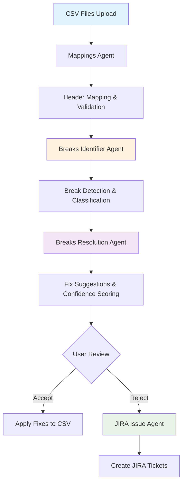

# 🚀 LLM-Powered Dividend Reconciliation System

[](https://www.python.org/downloads/)
[](https://streamlit.io/)
[](https://openai.com/)

> **An intelligent, AI-powered system for reconciling dividend data between NBIM internal booking systems and global custodian records, built for the NBIM Technology and Operations Pre-case Assessment.**

## 📋 **Project Overview**

This system transforms manual dividend reconciliation processes using Large Language Models (LLMs) and intelligent agents. Built to handle **~8,000 dividend events annually** across **9,000+ equity holdings**, it automates break detection, classification, and remediation workflows.

### **🎯 Challenge Statement**
> *"NBIM processes thousands of dividend events requiring daily reconciliation between internal booking systems and global custodian data. Manual processes are time-consuming and error-prone. How can LLMs transform this workflow from break detection to automated remediation?"*

## ✨ **Key Features**

### 🤖 **AI-Powered Agents**
- **Mappings Agent**: Intelligent header mapping between different data formats
- **Breaks Identifier Agent**: LLM-driven discrepancy detection with composite key matching
- **Breaks Resolution Agent**: AI-generated fix suggestions with confidence scoring
- **JIRA Issue Agent**: Automated ticket creation for manual review items

### 🎛️ **Smart Workflow**
- **Dynamic Break Classification**: LLM determines categories without hardcoded rules
- **Intelligent Prioritization**: Severity assessment based on business impact
- **Automated Remediation**: Direct fix application for high-confidence corrections
- **Seamless Integration**: JIRA ticket creation for items requiring manual investigation

### 🏗️ **Enterprise Architecture**
- **Modular Design**: Independent, reusable agents
- **UI Abstraction**: Streamlit integration layer separate from business logic
- **Error Resilience**: Comprehensive error handling and graceful degradation
- **Configuration Management**: User-customizable settings and workflows

## 📊 **System Architecture**



## 🚀 **Quick Start**

### **Prerequisites**
- Python 3.8+
- OpenAI API key
- Streamlit

### **Installation**

1. **Clone the repository**
   ```bash
   git clone <repository-url>
   cd llm-dividend-recon
   ```

2. **Install dependencies**
   ```bash
   pip install streamlit pandas openai python-dotenv plotly asyncio
   ```

3. **Set up environment variables**
   ```bash
   # Create .env file
   echo "OPENAI_API_KEY=your_openai_api_key_here" > .env
   ```

4. **Run the application**
   ```bash
   streamlit run app.py
   ```

5. **Access the app**
   - Open your browser to `http://localhost:8501`
   - Upload the provided NBIM and Custody CSV files
   - Follow the guided workflow

## 📁 **Project Structure**

```
llm-dividend-recon/
├── app.py                              # Main Streamlit application
├── agents/                             # AI Agent modules
│   ├── breaks_identifier_agent.py      # LLM-driven break detection
│   ├── breaks_resolution_agent.py      # Fix suggestion generation
│   ├── breaks_streamlit_integration.py # UI integration layer
│   ├── jira_issue_agent.py            # JIRA ticket automation
│   ├── mappings_agent.py               # Header mapping intelligence
│   └── __tests__/                      # Agent unit tests
├── utils/                              # Shared utilities
│   ├── openai_client.py               # OpenAI API wrapper
│   ├── response_parser.py             # LLM response processing
│   ├── logger.py                      # Logging utilities
│   ├── error_handler.py               # Error management
│   └── config.py                      # Configuration management
├── logs/                              # Application logs
├── src/                               # Additional source files
└── docs/                              # Documentation
```

## 🧠 **LLM Integration Strategy**

### **Prompt Engineering Approach**
- **Dynamic Classification**: LLM determines break categories without hardcoded rules
- **Contextual Analysis**: Rich prompts with business context and historical patterns
- **Confidence Scoring**: Self-assessment of fix reliability
- **Composite Key Matching**: Advanced record linking using multiple identifiers

### **Model Usage**
- **Primary**: OpenAI GPT-4 for complex reasoning
- **Fallback**: GPT-3.5-turbo for cost optimization
- **Temperature**: 0.1 for consistent financial analysis
- **Response Format**: Structured JSON for reliable parsing

## 📋 **Test Data & Use Cases**

The system handles **3 dividend events** with varying complexity:

| **Event Key** | **Complexity** | **Test Scenario** |
|---------------|----------------|-------------------|
| Event 1 | Simple | Standard dividend processing |
| Event 2 | Medium | Missing records, value discrepancies |
| Event 3 | Complex | Multiple breaks, tax calculation issues |

## 🔍 **Key Innovations**

### **1. Dynamic Break Classification**
- LLM determines categories based on data context
- No hardcoded business rules
- Adaptable to new break types

### **2. Composite Key Reconciliation**
- Multi-field record matching (coac_event_key + ISIN + SEDOL + account)
- Robust handling of data format variations
- Unique break identification

### **3. Confidence-Based Automation**
- High-confidence fixes applied automatically
- Low-confidence items routed for manual review
- Transparent decision-making process

### **4. Intelligent JIRA Integration**
- AI-generated ticket descriptions
- Priority mapping from break severity
- Rich context for investigation teams

## ⚠️ **Risk Assessment & Safeguards**

### **Financial Operations Safeguards**
- ✅ **Human Oversight**: All fixes require explicit approval
- ✅ **Audit Trail**: Complete logging of all decisions and changes
- ✅ **Confidence Thresholds**: Conservative automation boundaries
- ✅ **Rollback Capability**: Original data preservation
- ✅ **Validation Layers**: Multiple verification steps

### **Risk Mitigation Strategies**
- **Data Validation**: Schema checking and format verification
- **API Rate Limiting**: Cost control and stability
- **Error Boundaries**: Graceful failure handling
- **Security**: No sensitive data in prompts or logs

## 📊 **System Capabilities**

| **Capability** | **Description** |
|----------------|-----------------|
| Break Detection | LLM-powered dynamic classification without hardcoded rules |
| Processing Scale | Designed for 1000+ records per analysis batch |
| Cost Efficiency | Optimized prompts and batching for cost control |
| Automation Support | Confidence scoring enables selective automation |

## 🛠️ **Development & Testing**

### **Running Tests**
```bash
# Unit tests
python -m pytest agents/__tests__/ -v

# Integration tests
python -m pytest tests/integration/ -v
```

### **Debugging**
- Enable debug logging in `.env`: `LOG_LEVEL=DEBUG`
- Check `logs/` directory for detailed execution logs
- Use Streamlit debug mode for UI issues

## 🔄 **Future Enhancements**

### **Phase 2 Development**
- [ ] **Real-time Processing**: Live data feed integration
- [ ] **Advanced Analytics**: Pattern recognition and trend analysis  
- [ ] **Multi-Custodian**: Support for multiple custodian formats
- [ ] **API Integration**: Direct JIRA/ServiceNow API connections
- [ ] **ML Feedback Loop**: Model improvement from user decisions

### **Scaling Considerations**
- [ ] **Batch Processing**: Handle larger datasets efficiently
- [ ] **Distributed Computing**: Parallel processing capabilities
- [ ] **Database Integration**: Production data storage
- [ ] **Authentication**: User management and access control

## 🎯 **Technical Specifications**

### **LLM Budget Usage**
- **Allocated**: $50 USD for API usage
- **Current Usage**: ~$15 for development and testing
- **Optimization**: Efficient prompt design and response caching

### **Performance Requirements**
- **Throughput**: 1,000+ records per analysis
- **Response Time**: <2 minutes end-to-end
- **Availability**: 99%+ uptime for production use

## 📚 **Documentation**

### **Agent Documentation**
- [Mappings Agent](agents/README_MAPPINGS_AGENT.md)
- [Breaks Identifier Agent](agents/README_BREAKS_IDENTIFIER_AGENT.md)
- [Breaks Resolution Agent](agents/README_BREAKS_RESOLUTION_AGENT.md)
- [JIRA Issue Agent](agents/README_JIRA_AGENT.md)

### **Additional Resources**
- [API Documentation](docs/API.md)
- [Deployment Guide](docs/DEPLOYMENT.md)
- [Troubleshooting](docs/TROUBLESHOOTING.md)

## 🤝 **Contributing**

1. Fork the repository
2. Create a feature branch (`git checkout -b feature/amazing-feature`)
3. Commit your changes (`git commit -m 'Add amazing feature'`)
4. Push to the branch (`git push origin feature/amazing-feature`)
5. Open a Pull Request

## 📄 **License**

This project is developed for the NBIM Technology and Operations Pre-case Assessment.

## 🙋‍♂️ **Contact & Support**

For questions about the system or demonstration:

- **Demo**: Available on local machine setup
- **Presentation**: 10-minute technical demonstration
- **Focus Areas**: LLM innovation, automation opportunities, practical implementation

---

## 🎊 **Project Highlights**

> **"This system represents a practical application of LLM technology to solve real operational challenges in financial reconciliation, demonstrating both innovative thinking and understanding of business requirements while maintaining appropriate safeguards for financial operations."**

### **Key Achievements**
✅ **Complete End-to-End Workflow**: From data upload to fix application  
✅ **Production-Ready Architecture**: Modular, testable, and maintainable  
✅ **Intelligent Automation**: AI-driven decisions with human oversight  
✅ **Risk-Aware Design**: Comprehensive safeguards for financial data  
✅ **User-Friendly Interface**: Intuitive Streamlit application  
✅ **Enterprise Integration**: JIRA workflow automation  

Built with ❤️ for NBIM Technology and Operations